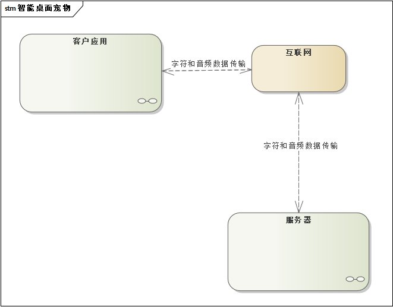
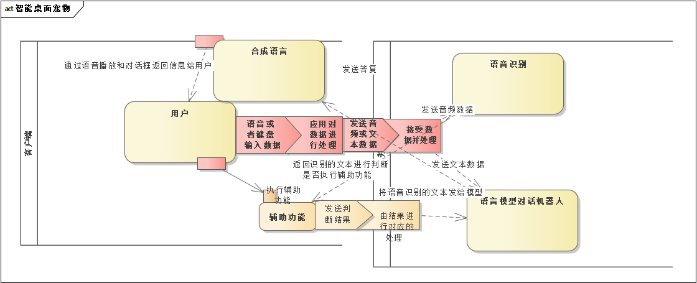

# 题目：智能桌面宠物应用

## 问题定义

随着人工智能技术的快速发展，用户对于智能交互的需求日益增强。为了满足用户的情感交流需求，我们设计了一款智能语言桌面宠物应用。这款应用能够模拟真实宠物的语言交流，与用户进行互动，提供情感支持和娱乐体验，同时也作为我们生活中的帮手，解决生活中的疑问。

智能语言桌面宠物应用是一款运行在桌面环境下的虚拟宠物应用，具备语言交流、情感表达和智能互动等功能。用户可以通过与桌面宠物进行对话等互动行为，建立深厚的情感联系，享受养宠的乐趣。可以让宠物辅助我们工作。

本项目主要面向以下两类人群：

1. **技术宅**：与电脑相处的时间远大于人际交往的时间，这类人在情感上有着大量的空白，智能桌面宠物是填补这一空白的好方法。
2. **办公人员**：高强度的工作，千篇一律的生活，他们需要给生活带来些点缀，智能宠物可以给他们的生活增添光彩。

## 需求分析

### 功能性需求

1. 语言交流

   - 桌面宠物具备语音识别和语音合成功能，能够与用户进行对话。用户可以通过语音指令与宠物交流，宠物也能够以语音形式回应用户，实现双向的语言交流。

2. 情感表达

   - 桌面宠物能够根据用户的互动行为和语言内容，表现出不同的情感状态。宠物会有喜怒哀乐等表情变化，甚至能够模拟出真实的宠物行为，如摇尾巴、眨眼等，增加用户的互动体验。

3. 智能互动

   - 桌面宠物具备智能学习能力，能够根据用户的喜好和行为习惯进行个性化互动。宠物会主动与用户进行互动，如提醒用户休息、分享趣事等，增加用户的参与感和乐趣。

4. 辅助功能

   - 桌面宠物可以接受简单的指令去帮助用户完成某些事情
   - 桌面宠物可以回答我们的疑问

   用例图如下：

   

### 典型应用场景

**场景一：用户想解答某个疑惑**

- 用户可以直接通过语言对话询问桌面宠物，也可以让宠物帮你使用百度搜索结果

**场景二：用户感觉疲惫迷茫**

- 用户可以与桌面宠物进行聊天互动，缓解疲惫

### 非功能性需求（可选）

1. 性能需求
   - 系统响应时间：系统应在用户发出请求后的合理时间内作出响应。
   - 处理能力：系统应能够同时处理多个用户的请求，确保在高峰时段也能提供稳定的服务。
   - 资源利用率：系统应有效利用硬件和网络资源，避免不必要的浪费。
2. 可用性需求
   - 用户界面：系统应提供直观、易用的用户界面，降低用户的学习成本。
   - 反馈机制：系统应在关键时刻给出明确的反馈，帮助用户了解系统的状态和下一步操作。
   - 错误处理：系统应能够优雅地处理错误，给出有用的错误信息，并允许用户轻松恢复。
3. 可维护性需求
   - 日志记录：系统应生成详细的日志记录，以便在出现问题时进行故障排查。
   - 模块化设计：系统应采用模块化设计，方便后期对特定功能进行升级或替换。
   - 文档支持：系统应提供完整的开发和使用文档，帮助开发人员和维护人员理解系统。

## 关键技术

**这里罗列了这个项目的实现难点部分是怎么考虑的，如何解决的。在设计和实现中遇到了什么问题，最终如何解决的。**

### 模型选择、部署以及推理速度

   最初选择是基于百度paddle平台去实现各个人工智能模型的训练和推理，后来发现直接部署在平台上调用模型接口需要花钱，而部署在笔记本里显卡带不动模型，后来打算弄一台服务器，结果cuda版本过高，无法安装paddle，因此改用torch模型，同时受显存大小限制，选用量化后的模型，最终敲定：chatglm-6b-int4模型、whisper的medium模型、GPT-SoVITS模型、以及pyttsx3作为备用。

### 微调大语言模型，制作聊天机器人

    这里采用了简单一些的方法，大语言模型本身就拥有通过对话学习的能力，在此基础上给模型添加模板设定，给予它一个设定就能得到我们想要的机器人了，再给他不断保存对话的记录。

### 如何传输音频数据

​    为保证宠物答复的及时性，决定采用实时通讯的方式传输音频，但whisper模型并没有直接推理音频数据的接口，所以将传输的音频数据先写入wav文件，再读取推理

### 宠物移动边界问题

​	因为只有左右的gif所以左右边界比较好控制，上下最初在只改方向、随机播放的情况下会出现在边界抽搐的现象，后取消上下边界的限制，新增‘回来’的方法让宠物回到屏幕。

### 播放视频

​	开始使用OpenCV来打开视频并直接全屏，并加上音频一起播放，发现音频比视频短了一点点，在最后部分循环最后一点，最后改成直接使用系统命令调用系统默认的视频播放软件来打开指定路径的视频文件。

## 静态设计

### 部署方案

先进行部署方案的文字介绍，如：

本课题是一个基于客户端-服务端（C/S）架构的智能桌面宠物应用。该系统允许用户通过exe应用程序，与宠物进行互动。软件的核心组件包括对话机器人服务、语音识别服务，这些组件均部署在同一台物理服务器上，以实现高效的数据交换和处理。

**下面的UML图，大家自行绘制EA**

### 系统组成

这里是模块的划分。根据模块划分，以方便将任务分配出去，以及后续的故障诊断和单元测试，也有利于系统封装.

下面只是供参考。具体内容可以根据实现细节做介绍。每个模块要说明清楚这个模块的功能是什么，对外交互的接口是什么（输入输出），是否有特别需要交待的设计思路。

#### 宠物模块

实现一个可以在桌面上自由走动的宠物，可以用语音、键盘、鼠标进行交互，根据部分指令可以完成一些辅助操作

#### 通信模块

客户端与服务端进行信息传递，以实现实时语音传输，字符信息传递

#### 日志模块

将应用运行时的状态记录为日志文件，以便日常维护所用

#### 语音模块

对用户数据进行语音识别以及合成语音，通过音频数据文件进行输入，语音识别为文本，或是文本输入转为语音

#### 语言模块

利用大语言模型打造对话机器人，可与用户进行拟人化的对话，输入文本对话，机器人做出答复，返回回答文本

.....

## 动态设计

动态设计通过典型场景的实现过程，介绍如何通过各个模块的配合完成一个典型任务。可以使用顺序图，通讯图，状态图等。自行选择

### 学生完成任务与动作评估

学生登录系统后，开始完成体育老师发布的任务，并通过动作指导与评估模块进行实时动作比对和评估。

这里绘制UML顺序图（以下只有文字，请自行转为UML图）

这里给出界面截图，并且进行说明

### 老师发布任务与查看学生报告

略....

## xxx这个部分自行设计

需要补充的章节，自行定义。例如测试、非功能性设计考虑等。

