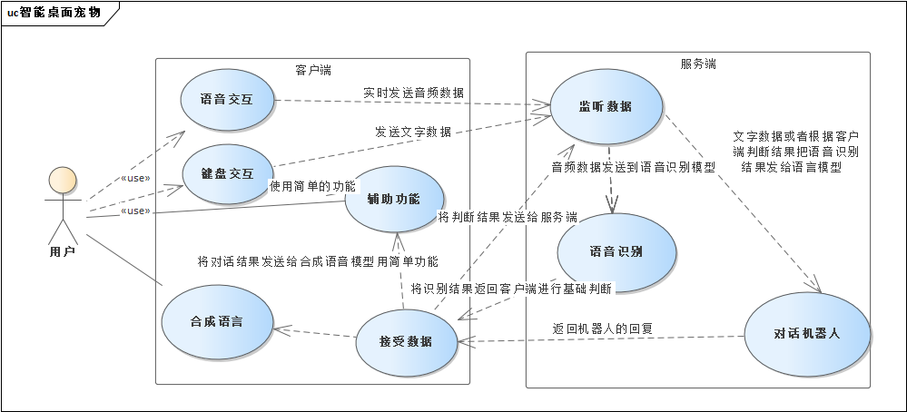

# 智能桌面宠物应用

## 项目介绍

### 项目背景

随着人工智能技术的快速发展，用户对于智能交互的需求日益增强。为了满足用户的情感交流需求，我们设计了一款智能语言桌面宠物应用。这款应用能够模拟真实宠物的语言交流，与用户进行互动，提供情感支持和娱乐体验，同时也作为我们生活中的帮手，解决生活中的疑问。

### 项目意义

智能语音识别桌面宠物是一款集成了语音识别技术和人工智能算法的智能机器人。智能语音识别桌面宠物采用了先进的语音识别技术和人工智能算法，确保准确识别用户的语音指令和语义理解。它还通过调用Windows API和其他电脑软件接口来实现对电脑功能的控制。通过语音识别技术，用户可以与桌面宠物进行自然语言交互，轻松实现聊天、控制电脑等功能。它适用于多种场景，能够满足用户在生活和工作中的多样化需求，为用户带来更智能、更便捷的生活体验。

## 项目内容

### 项目链接

    https://github.com/xycdaimi/Guka/tree/master

### 项目流程

   

### 项目环境

#### 客户端

    在windows系统环境下运行使用的应用程序

#### 服务端

    本次项目在linux系统环境下测试运行，需要可进行深度学习gpu加速的显卡，显存12G及以上，安装cuda和cudnn环境，使用miniconda或anaconda以便隔离环境，可配置公网访问，无公网ip安装cpolar内网穿透工具进行端口映射。

### 项目技术

项目实现的主要技术为chatglm-6b量化模型、whisper多语言语音识别模型、pyttsx3合成语音库、socket通信、thread多线程运行、qt应用程序、ps技术、windows系统接口api

- Whisper模型：是一种通用语音识别模型。它是在各种音频的大型数据集上训练的，也是一个多任务模型，可以执行多语言语音识别、语音翻译和语言识别。能精准的识别用户的语音，帮助宠物了解用户的话语

- chatglm模型：ChatGLM 是一个开源的、支持中英双语问答的对话语言模型，基于 General Language Model (GLM) 架构，具有 62 亿参数。结合模型量化技术，用户可以在消费级的显卡上进行本地部署。ChatGLM针对中文问答和对话进行了优化。经过约 1T 标识符的中英双语训练，辅以监督微调、反馈自助、人类反馈强化学习等技术的加持，62 亿参数的 ChatGLM已经能生成相当符合人类偏好的回答。由此模型进行微调制作宠物对话机器人，可以更加的人性化，更好的辅助用户。

- edge-tts模型：edge-tts是一个基于Edge TTS的语音合成库，它能够将文本转换为逼真的语音。通过调用Edge TTS的API，可以实现将文本转换为语音的功能。

- so-vits-svc模型：语音克隆模型，实现音色转化，以此达到个性化声音的效果

- socket通信：实现实时稳定的tcp通讯，解决客户端与服务端的数据交互

- thread多线程：实现各功能并行运行，在不会影响主程序的情况下在后台处理数据

- qt应用程序：客户端的基础框架，在此基础上实现桌面宠物的应用程序

- ps技术：制作宠物形象动画

- windows系统接口api：作为辅助功能，能帮用户完成一些小的功能

### 项目过程

#### 需求分析

    项目启动之初，我们进行了详尽的需求分析，深入探究用户对智能桌面宠物的期待和需求，为后续的设计与开发奠定了坚实基础。

####  设计阶段

    根据需求分析的结果，我们精心设计了宠物的外观、动作及交互方式。为了确保宠物的可爱与吸引力，我们进行了多次原型设计与用户调研，不断优化设计方案。

####  开发阶段

    设计方案确定后，我们迅速投入开发工作。采用先进的技术与框架，我们成功实现了宠物的动画效果、语音识别与合成、智能交互等功能。

#### 项目成果

##### 第一次打开应用

<video controls src="https://pan.baidu.com/s/130gCFdMjrkRXIv4uA2mClA?fid=704315713862542" title="第一次打开应用"></video>

##### 宠物形象实现

<video controls src="https://pan.baidu.com/s/130gCFdMjrkRXIv4uA2mClA?fid=516293634371934" title="宠物形象实现"></video>

##### 宠物语音交互

<video controls src="https://pan.baidu.com/s/130gCFdMjrkRXIv4uA2mClA?fid=1040559561215021" title="宠物语音交互"></video>

##### 宠物键盘交互

<video controls src="https://pan.baidu.com/s/130gCFdMjrkRXIv4uA2mClA?fid=171783028537360" title="宠物键盘交互"></video>

##### 宠物辅助功能

<video controls src="https://pan.baidu.com/s/130gCFdMjrkRXIv4uA2mClA?fid=91983268306324" title="宠物辅助功能"></video>

####  测试与优化

    初步开发完成后，我们进行了多次严格的测试，发现并修复了潜在的问题与漏洞。同时，根据用户的反馈，我们不断优化应用的功能与性能。

### 项目展望

    未来，我们将继续优化模型，提高模型的准确性和性能，并不断更新和扩展功能，为用户提供更加智能、更加便捷的桌面宠物应用。

## 项目成员

### 项目组长

- 姓名：谢宇宸
- 学号：212106052
- 班级：计科1班
- 邮箱：2332607961@qq.com

### 项目组员

- 姓名：罗航
- 学号：212106038
- 班级：计科1班
- 邮箱：3041176185@qq.com

- 姓名：伍定楠
- 学号：212106050
- 班级：计科1班
- 邮箱：1229461403@qq.com

## 项目总结

本次智能桌面宠物应用项目的成功实现，离不开团队成员的共同努力与持续创新。展望未来，我们将继续优化应用的功能与性能，拓展更多的应用场景与娱乐内容，为用户提供更加优质的交互体验。同时，我们也期待与更多的合作伙伴共同探索智能桌面宠物应用的更多可能性，为行业的发展贡献更多力量。